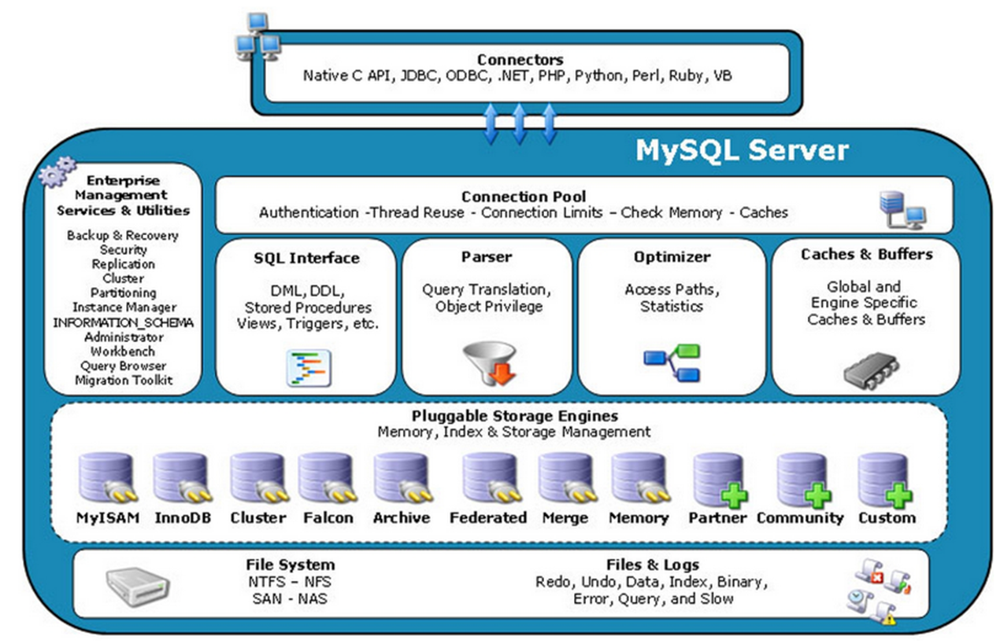

# 一、MySQL

## MySQL的简单描述

登录MySQL服务器的命令：

```shell
mysql -hlocalhost -P3306 -uroot -p加密码
# 本机一般简写成：
mysql -uroot -p加密码
```

DB和DBMS

>DB : DataBase（数据库，数据库实际上在硬盘上以文件的形式存在）
>
>DBMS : 数据库管理软件

SQL语句的分类

> DQL : (数据查询语言), 查询语句, select
>
> DML : (数据操作语言), 增删改, insert,delete,update
>
> DDL : (数据定义语言), 对表结构进行增删改create, drop, alter 
>
> TCL : (事务控制语言), 事务. commit,rollback
>
> DCL : (数据控制语言), qrant (授权) , revoke (撤销权限)

数据库的创建和删除

``` sql
CREATE DATABASE IF NOT EXISTS [database];
DROP DATABASE [database];
```

## SQL语句

### 数据查询DQL

```sql
SELECT * FROM database
```

**where 条件查询**

重点注意:

- `between...and..`两个值之间, 等同于 `>= and <=`

- 数据库中NULL不是一个值, 代表什么都没有

like 模糊查询

%表示任意多个字符, _表示任意一个字符

**排序: order by**

DESC 降序	ASC 升序

**分组函数:** 

> count	计数
>
> sum	求和
>
> avg	平均值
>
> max	最大值
>
> min	最小值

注意 : 分组函数自动忽略NULL

eg : 找出高于平均年龄的用户

```sql
# 错误示例
# select * from t_user where age > avg(age)
# 正确示例
select * from t_user where age > (select avg(age) from user);
```

原因 : **分组函数不可以直接使用在where字句当中**

因为 group by是在where之后执行的。所以说还没有分组，不能用分组函数，没有group by 语句也自成一组，即有缺省的group by。

**group by和having**

group by : 按照某个字段或者某些字段进行分组。
having : having 是对分组之后的数据进行再次过滤。
两者必须联合使用。

eg : 找出每个部门最高薪资, 要求显示薪资大于2500的数据

```sql
SELECT max(sal) deptno FROM t_emp group by deptno having max(sal) > 2900
SELECT max(sal) deptno FROM t_emp WHERE sal>2500 group by deptno  (效率高)
```

select语句总结:

> select ...		5
>
> from ...		1
>
> where ...		2
>
> group by ...	3
>
> having ...		4
>
> order by ...	6
>
> limit ...		7

1. 首先执行where语句过滤原始数据
2. 执行group by 进行分组
3. 执行having对分组数据进行操作
4. 执行select选出数据
5. 执行order by排序
6. 取结果集的部分数据

原则 : 能在where中过滤的数据, 尽量在where中过滤, 效率较高. having是专门过滤分组之后的数据的

distinct : 查询结果集的去重

### 表的连接查询

内连接: 两张表没有主次之分

```sql
select
	e.ename,d.dname
from
	emp e
(inner) join(inner可以省略，可读性好。)(内连接)
	dept d
on
	e.deptno = d.deptno;
```

外连接: 主要查询主表中的数据，捎带着查询副表，副表中的数据没有和主表的数据匹配上，副表自动模拟出NULL与之匹配

```sql
select
	a.ename '员工' , b.ename '领导'
from
	emp a
left (outer) join(左外连接,outer可以省略)
	emp b
on
	a.mgr = b.empno;
```

union : 可以将查询结果集相加

union可以将两张不相干的表中的数据拼接在一起, 但两个部分的列数要相同

### 数据操作

insert

```sql
# 插入数据
insert into t_user (id,name,age) values ('1','zhngsan','18')
# 简介插入
insert into t_user values ('1','zhangsan','18')
# 多条记录插入
insert into t_user (id,name,age) values ('1','zhngsan','18'),('2','lisi','20')
```

`一次插入多条数据` 和 `多次插入一条数据`

因为插入操作只有一次，所以也类似事务操作，插入失败则全失败，插入成功则全成功，使数据的管理更加方便。所以，如果有多条数据需要插入同一个表的，尽量用这种方式.

| 数据条数 | 一次性全插 (单位 : s) | 多次插入 (单位 : s) |
| :------: | :-------------------: | :-----------------: |
|    10    |         0.03          |        0.06         |
|   100    |         0.03          |         0.2         |
|   1000   |         0.06          |        1.95         |
|  10000   |         0.55          |        26.5         |
|          |                       |                     |

update

```sql
update t_user set name = 'wangwu' where name = 'zhangsan'
```

delete

```sql
delete from t_user where name = 'zhangsan'
```

删除数据库所有记录:

```sql
delete from t_user #delete效率太差, 不会释放空间, 可以撤销
truncate table t_user #表被截断, 不可撤销, 永久丢失, (删除大文件)
```

### 约束

> 非空约束：（not null）约束的字段不能为NULL。
> 唯一约束：（unique）约束的字段不能重复。
> 主键约束：（primary key）约束的字段既不能为NULL,也不能重复。
> 外键约束：（foreign key）简称FK
> 检查约束：（check)

## 索引
索引（index）是帮助MySQL高效获取数据的数据结构（有序）

索引也是一张表，该表保存了主键与索引字段，并指向实体表的记录

#### 索引优势劣势
优势
- 提高数据检索的效率，降低数据库的IO成本
- 通过索引列对数据进行排序，降低数据排序的成本，降低CPU的消耗


#### 索引的结构
- BTREE索引
- Hash索引
- RTREE索引（地理空间）
- 全文索引

#### 常用索引的分类
- 普通索引：普通索引是最基本的索引类型，唯一任务是加快对数据的访问速度，没有任何限制
- 唯一性索引：唯一性索引是不允许索引列具有相同索引值的索引。创建唯一性索引的目的往往不是为了提高访问速度，而是为了避免数据出现重复。
- 主键索引：主键索引是一种唯一性索引，即不允许值重复或者值为空，并且每个表只能有一个主键。
- 单列索引
- 多列索引

创建索引 : 

```sql
create table t_user(
	id int ,  # 可以在这里加上 primary key
    # id int index # 不能在这里加入索引,因为index只是索引,没有约束一说
    name varchar(50)
    # 以下两种可加
    # primary key(id)
    # index(id)
);
#在创建表后添加
create index name on t_user(name); #添加普通索引
create unique age on t_user(age); #添加唯一索引
alter table t_user add primary key(id); #添加主键索引
create index name on t_user(id,name); #添加普通联合索引
```

删除索引 : 

```sql
drop index name on t_user; # 删除普通索引
drop index age on t_user; # 删除唯一索引, 不用添加unique
alter table t_user drop primary key; # 删除主键, 添加的时候使用的是alter,删除的时候也用alter
```


注意 : 索引虽然可以提高检索效率，但是不能随意添加索引，因为索引也是数据库当中的对象，也需要数据库不断的维护，是由维护成本的，比如，表中的数据经常被修改这样就不适合添加索引，因为数据一旦修改，索引就需要重新维护。

## 视图

 视图（View）是一种虚拟存在的表。视图并不在数据库中实际存在，行和列数据来自定义视图的查询中使用的表，并且是在使用视图时动态生成的。

- 简单
- 安全
- 数据独立

创建视图

```sql
CREATE [OR REPLACE]
VIEW view_user 
AS select * from user;
```

修改视图

```sql
ALTER VIEW view_user 
AS select * from user;
```

查询视图的定义

```sql
SHOW CREATE VIEW view_user;
```

删除视图

```sql
DROP VIEW [IF EXISTS] view_user;
```

## 存储过程和函数

创建存储过程

```sql
CREATE PROCEDURE procedure_user([proc_parameter[,...]])
begin
	select 'Hello World' -- SQL语句
end ;
```

调用存储过程

```sql
call procedure_user();
```

查询存储过程

```sql
-- 查询数据库中所有的存储过程
select name from mysql.proc where db='study_mysql'
-- 查询存储过程的状态信息
show procedure status;
-- 查询某个存储过程的定义
show create procedure study_mysql.procedure_user \G;
```


删除存储过程

```sql
DROP PROCEDURE  [IF EXISTS] procedure_user ;
```


## Mysql的结构




## 存储引擎

每一个存储引擎都对应一种不同的存储方式。

mysql默认使用的存储引擎是InnoDB方式。

```sql
# 查看当前mysql支持的存储引擎
show engines (\G)
```

常见的存储引擎:

- MySIAM : 这种存储引擎不支持事务

- InnoDB : 支持事务，行级锁，外键，级联删除和级联更新等。这种引擎数据最安全。
- MEMORY : 查询数据最快, 不支持事务，数据容易丢失，因为表数据和索引都是存储在内存当中

### InnoDB


## 事务

一个事务是一个完整的业务逻辑单元，不可再分。必须同时成功，或者同时失败

开启事务	begin
提交事务（会写到文件）commit
回滚事务（不会写到文件）rollback

事务控制语句：

- BEGIN : 显式地开启一个事务
- COMMIT : 提交事务，对数据库进行的所有修改成为永久性的
- ROLLBACK : 回滚会结束用户的事务，并撤销正在进行的所有未提交的修改，不会修改数据库
- SAVEPOINT identifier: 允许在事务中创建一个保存点，一个事务中可以有多个 SAVEPOINT
- RELEASE SAVEPOINT identifier  : 删除一个事务的保存点，当没有指定的保存点时，执行该语句会抛出一个异常
- ROLLBACK TO identifier : 把事务回滚到标记点
- SET TRANSACTION : 用来设置事务的隔离级别

事务的特征:  事务包括四大特性：ACID

- 原子性 (Atomicity): 事务是最小的工作单元，不可再分

- 一致性 (Consistency): 事务必须保证多条DML语句同时成功或者同时失败, 在事务开始之前和事务结束以后，数据库的完整性没有被破坏

- 隔离性 (Isolation): 数据库允许多个并发事务同时对其数据进行读写和修改的能力，隔离性可以防止多个事务并发执行时由于交叉执行而导致数据的不一致

- 持久性 (Durability): 事务处理结束后，对数据的修改就是永久的，即便系统故障也不会丢失

InnoDB 存储引擎提供事务的隔离级别有：

- READ UNCOMMITTED：读未提交
- READ COMMITTED：不可重复读
- REPEATABLE READ：可重复读
- SERIALIZABLE：序列化

# 二、数据结构

## 数组

自己实现的ArrayList ==>

底层结构

```java
/**
 * 默认的容量
 */
private static final int DEFAULT_CAPACITY = 10;
/**
 * 作为list的底层数据
 */
transient Object[] elementData;
/**
 * List的容量
 */
private int size;
```

构造方法

```java
public ArrayList() {
    this.elementData = DEFAULTCAPACITY_EMPTY_ELEMENTDATA;
}

public ArrayList(int size) {
    if (size > 0) {
        this.elementData = new Object[size];
    } else if (size == 0) {
        this.elementData = DEFAULTCAPACITY_EMPTY_ELEMENTDATA;
    } else {
        throw new IllegalArgumentException("Illegal Capacity: " + size);
    }
}
```

新增操作

```java
/**
 * 添加数据
 *
 * @param value 值
 * @return boolean
 */
@Override
public boolean add(E value) {
   add(value, elementData, size);
   return true;
}

/**
 * 添加数据
 *
 * @param e           添加的数据
 * @param elementData 添加的数组
 * @param size        数据的大小
 */
public void add(E e, Object[] elementData, int size) {
   if (size == elementData.length) {
      elementData = grow();
   }
   elementData[size] = e;
   this.size = size + 1;
}
```

扩容

```java
/**
 * 扩容
 *
 * @param minCapacity 最小的容量
 * @return Object[]
 */
private Object[] grow(int minCapacity) {
   int length = size << 1;
   if (length <= minCapacity) {
      //扩容之后,还是比之前的小
      length = DEFAULT_CAPACITY;
   }
   return elementData = Arrays.copyOf(elementData, length);
}
```

移除数据

```java
/**
 * 移除指定索引的数据
 *
 * @param index 移除的索引
 * @return 移除的值
 */
@Override
public E remove(int index) {
    @SuppressWarnings("unchecked")
    E oldValue = (E) elementData[index];
    Object[] elementData = this.elementData;
    fastRemove(elementData, index);
    return oldValue;
}

/**
 * 移除指定的数据
 *
 * @param o 需要移除的数据
 * @return boolean
 */
@Override
public boolean remove(Object o) {
    int index = indexOf(o);
    if (index < 0) {
        return false;
    }
    Object[] elementData = this.elementData;
    fastRemove(elementData, index);
    return true;
}
```

获取数据

```java
/**
 * 通过索引获取数据
 *
 * @param index 指定索引
 * @return E
 */
@Override
public E get(int index) {
    return elementData(index);
}

/**
 * 获取数据
 *
 * @param index 索引
 * @return E
 */
@SuppressWarnings("unchecked")
E elementData(int index) {
    return (E) elementData[index];
}
```


## 链表


## 栈


## 队列


## 树

### 二叉查找树

添加一个节点

```java
/**
 * 添加一个节点
 *
 * @param treeNode 节点
 * @return boolean
 */
@Override
public boolean add(TreeNode<T> treeNode) {
    if (this.root == null) {
        //root不存在
        this.root = treeNode;
        return true;
    }

    TreeNode<T> current = this.root;
    for (; ; ) {
        if (current.getValue().compareTo(treeNode.getValue()) >= 0) {
            //如果current的值大于传入的值
            if (current.getLeft() != null) {
                current = current.getLeft();
            } else {
                current.setLeft(treeNode);
                break;
            }
        } else {
            if (current.getRight() != null) {
                current = current.getRight();
            } else {
                current.setRight(treeNode);
                break;
            }
        }
    }
    return true;
}
```

删除一个节点

```java
/**
 * 删除一个节点
 *
 * @param value 值
 * @return boolean
 */
@Override
public boolean delete(T value) {
   TreeNode<T> parent = null;
   TreeNode<T> current = this.root;
   for (; ; ) {
      if (current.getValue().compareTo(value) == 0) {
         delete(parent, current);
         return true;
      } else if (current.getValue().compareTo(value) > 0) {
         //如果传入的值小于current的值
         if (current.getLeft() != null) {
            parent = current;
            current = current.getLeft();
         } else {
            return false;
         }
      } else if (current.getValue().compareTo(value) < 0) {
         //如果传入的值大于current的值
         if (current.getRight() != null) {
            parent = current;
            current = current.getRight();
         } else {
            return false;
         }
      }
   }
}

/**
 * 删除节点
 *
 * @param parent  待删除的父节点
 * @param current 待删除的节点
 */
private void delete(TreeNode<T> parent, TreeNode<T> current) {
    //将中序后继节点的父节点左节点设置为null,增加参数setParentNull
    TreeNode<T> successorNode = this.getInOrderSuccessorTreeNode(current, true);

    if (parent != null) {
        //判断是左子节点还是右子节点
        if (parent.getRight() != null
            && parent.getRight().getValue().equals(current.getValue())) {
            parent.setRight(successorNode);
        } else {
            parent.setLeft(successorNode);
        }
    } else {
        //父节点为空,就是删除的根节点,把中序后继节点赋值给根节点
        this.root = successorNode;
    }

    if (successorNode != null) {
        successorNode.setLeft(current.getLeft());
        successorNode.setRight(current.getRight());
    }
}
```

### 平衡树

```md
# 左旋转：
1. 创建一个新节点，值等于当前根节点
2. 把新节点的左子树设置为当前节点的左子树
3. 把新节点的右子树设置为当前节点右子树的左子树
4. 把当前节点的值替换为右子节点的值
5. 把当前节点的右子树设置为右子树的右子树
6. 把当前节点的左子树设置为新的节点 

# 右旋转：
1. 创建一个新节点，值等于当前根节点
2. 把新节点的右子树设置为当前节点的右子树
3. 把新节点的左子树设置为当前节点左子树的右子树
4. 把当前节点的值替换为左子节点的值
5. 把当前节点的左子树设置为左子树的左子树
6. 把当前节点的右子树设置为新的节点
```


旋转策略：

- LL：根节点右旋
- LR：先根节点的左子树左旋，再根节点右旋
- RL：先根节点的右子树右旋，再根节点左旋
- RR：根节点右旋

计算树的高度：

```java
/**
 * 节点为node的树的高度
 *
 * @param node 节点
 * @return int
 */
public int height(TreeNode<T> node) {
	return Math.max(node == null ? 0 : height(node.getLeft()),
			node == null ? 0 : height(node.getRight())) + 1;
}
/**
 * 左子节树的高度
 *
 * @param node 节点
 * @return int
 */
public int lHeight(TreeNode<T> node) {
	return node == null ? 0 : height(node.getLeft());
}
/**
 * 右子节树的高度
 *
 * @param node 节点
 * @return int
 */
public int rHeight(TreeNode<T> node) {
	return node == null ? 0 : height(node.getRight());
}
```

旋转：

```java
/**
 * 旋转
 */
private boolean rotate() {
    //右子节点 - 左子节点 > 1 左旋
    if (rHeight(this.root) - lHeight(this.root) > 1) {
        //如果 右子树的 左子树高度 大于 右子树高度 ,先对右子树进行右旋
        if (this.root.getRight() != null &&
            lHeight(this.root.getRight()) > rHeight(this.root.getRight())) {
            rightRotate(this.root.getRight());
        }
        leftRotate(this.root);
    }
    //左子节点 - 右子节点 > 1 右旋
    else if (lHeight(this.root) - rHeight(this.root) > 1) {
        //如果 左子树的 右子树高度 大于 左子树高度 ,先对左子树进行左旋
        if (this.root.getLeft() != null &&
            rHeight(this.root.getLeft()) > lHeight(this.root.getLeft())) {
            leftRotate(this.root.getLeft());
        }
        rightRotate(this.root);
    }
    return true;
}

/**
 * 左旋转
 *
 * @param node 当前节点
 */
private void leftRotate(TreeNode<T> node) {
	//添加后, 右子节点 - 左子节点 > 1 左旋
	//1. 创建一个新节点，值等于当前根节点
	TreeNode<T> newNode = new TreeNode<T>(node.getValue());
	//2. 把新节点的左子树设置为当前节点的左子树
	newNode.setLeft(node.getLeft());
	//3. 把新节点的右子树设置为当前节点右子树的左子树
	newNode.setRight(node.getRight().getLeft());
	//4. 把当前节点的值替换为右子节点的值
	node.setValue(node.getRight().getValue());
	//5. 把当前节点的右子树设置为右子树的右子树
	node.setRight(node.getRight().getRight());
	//6. 把当前节点的左子树设置为新的节点
	node.setLeft(newNode);
}

/**
 * 右旋转
 *
 * @param node 当前节点
 */
private void rightRotate(TreeNode<T> node) {
	//添加后, 右子节点 - 左子节点 > 1 左旋
	//1. 创建一个新节点，值等于当前根节点
	TreeNode<T> newNode = new TreeNode<T>(node.getValue());
	//2. 把新节点的右子树设置为当前节点的右子树
	newNode.setRight(node.getRight());
	//3. 把新节点的左子树设置为当前节点左子树的右子树
	newNode.setLeft(node.getLeft().getRight());
	//4. 把当前节点的值替换为左子节点的值
	node.setValue(node.getLeft().getValue());
	//5. 把当前节点的左子树设置为左子树的左子树
	node.setLeft(node.getLeft().getLeft());
	//6. 把当前节点的右子树设置为新的节点
	node.setRight(newNode);
}
```

平衡树新增和删除节点

```java
/**
 * 平衡树添加节点
 * 双旋转目的 : 先解决一遍树的高度
 *
 * @param treeNode 节点
 * @return boolean
 */
@Override
public boolean add(TreeNode<T> treeNode) {
   super.add(treeNode);
   return rotate();
}

/**
 * 平衡树添加节点
 * 双旋转目的 : 先解决一遍树的高度
 *
 * @param value 需要删除的值
 * @return boolean
 */
@Override
public boolean delete(T value) {
   boolean delete = super.delete(value);
   if (delete) {
      return rotate();
   }
   return false;
}
```

### 红黑树

性质：

- 每个节点要么是黑色，要么是红色
- 根节点是**黑色**
- 每个叶子节点（NIL）是**黑色**
- 每个**红色**节点的**两个子节点**一定是**黑色**
- 任意一节点到每个叶子节点的路径都包含**相同数量的黑节点**


如果父节点存在，并且父节点是红色的

- 如果父节点是祖父节点的左孩子

  1. 如果叔叔节点是红色

     将父亲和叔叔节点变成黑色，将祖父节点(祖父几点之前一定是黑色的)变成红色，并将祖父节点设为当前节点接着判断

  2. 叔叔节点是黑色，且当前节点是右孩子

     以父节点为支点，进行左旋转，此时父节点变成子节点了，将父节点设为当前节点

  3. 叔叔节点是黑色，且当前节点是左孩子

     交换祖父节点和父亲节点的颜色，再以祖父节点为支点进行右旋转，此时当前节点还是新加入的节点

- 如果父节点是祖父节点的右孩子

  1. 如果叔叔节点是红色

     将父亲和叔叔节点变成黑色，将祖父节点(祖父几点之前一定是黑色的)变成红色，并将祖父节点设为当前节点接着判断

  2. 叔叔节点是黑色，且当前节点是右孩子

     以父节点为支点，进行左旋转，此时父节点变成子节点了，将父节点设为当前节点

  3. 叔叔节点是黑色，且当前节点是左孩子

     交换祖父节点和父亲节点的颜色，再以祖父节点为支点进行左旋转，此时当前节点还是新加入的节点

```java
/**
 * 红黑树节点
 *
 * @author xiaovcloud
 * @since 2021/10/20 8:24
 */
@Data
public class RBTreeNode<T extends Comparable<T>> {

   /**
    * 左子树
    */
   private RBTreeNode<T> left;
   /**
    * 右子树
    */
   private RBTreeNode<T> right;
   /**
    * 颜色,默认为红色
    */
   private boolean color;
   /**
    * 值
    */
   private T value;
   /**
    * 父节点
    */
   private RBTreeNode<T> parent;

   public static final Boolean RED = false;
   public static final Boolean BLACK = true;

   public RBTreeNode(T value) {
      this.value = value;
      this.color = RED;
   }

   public RBTreeNode(boolean color, T value) {
      this.color = color;
      this.value = value;
   }

   @Override
   public String toString() {
      return "RBTreeNode{" +
            "value=" + value +
            ", color=" + (color ? "black" : "red") +
            ", left=" + (left == null ? "null" : left.value) +
            ", right=" + (right == null ? "null" : right.value) +
            '}';
   }
}
```

定义红黑树中获取父节点和祖父节点的方法：

```java
/**
 * 获取父节点
 *
 * @param treeNode 当前节点
 * @return 父节点
 */
private RBTreeNode<T> getParent(RBTreeNode<T> treeNode) {
   if (treeNode == null) {
      return null;
   }
   return treeNode.getParent();
}

/**
 * 获取祖父节点
 *
 * @param treeNode 当前节点
 * @return 祖父节点
 */
private RBTreeNode<T> getGrandParent(RBTreeNode<T> treeNode) {
   if (treeNode == null || treeNode.getParent() == null) {
      return null;
   }
   return treeNode.getParent().getParent();
}
```


### B树


### B+树
