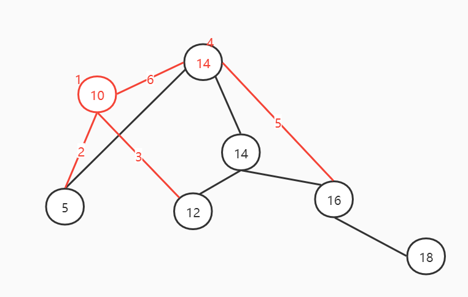

# 一、MySQL

## MySQL的简单描述

登录MySQL服务器的命令：

```shell
mysql -hlocalhost -P3306 -uroot -p加密码
# 本机一般简写成：
mysql -uroot -p加密码
```

DB和DBMS

>DB : DataBase（数据库，数据库实际上在硬盘上以文件的形式存在）
>
>DBMS : 数据库管理软件

SQL语句的分类

> DQL : (数据查询语言), 查询语句, select
>
> DML : (数据操作语言), 增删改, insert,delete,update
>
> DDL : (数据定义语言), 对表结构进行增删改create, drop, alter 
>
> TCL : (事务控制语言), 事务. commit,rollback
>
> DCL : (数据控制语言), qrant (授权) , revoke (撤销权限)

数据库的创建和删除

``` sql
CREATE DATABASE IF NOT EXISTS [database];
DROP DATABASE [database];
```

## SQL语句

### 数据查询DQL

```sql
SELECT * FROM database
```

**where 条件查询**

重点注意:

- `between...and..`两个值之间, 等同于 `>= and <=`

- 数据库中NULL不是一个值, 代表什么都没有

like 模糊查询

%表示任意多个字符, _表示任意一个字符

**排序: order by**

DESC 降序	ASC 升序

**分组函数:** 

> count	计数
>
> sum	求和
>
> avg	平均值
>
> max	最大值
>
> min	最小值

注意 : 分组函数自动忽略NULL

eg : 找出高于平均年龄的用户

```sql
# 错误示例
# select * from t_user where age > avg(age)
# 正确示例
select * from t_user where age > (select avg(age) from user);
```

原因 : **分组函数不可以直接使用在where字句当中**

因为 group by是在where之后执行的。所以说还没有分组，不能用分组函数，没有group by 语句也自成一组，即有缺省的group by。

**group by和having**

group by : 按照某个字段或者某些字段进行分组。
having : having 是对分组之后的数据进行再次过滤。
两者必须联合使用。

eg : 找出每个部门最高薪资, 要求显示薪资大于2500的数据

```sql
SELECT max(sal) deptno FROM t_emp group by deptno having max(sal) > 2900
SELECT max(sal) deptno FROM t_emp WHERE sal>2500 group by deptno  (效率高)
```

select语句总结:

> select ...		5
>
> from ...		1
>
> where ...		2
>
> group by ...	3
>
> having ...		4
>
> order by ...	6
>
> limit ...		7

1. 首先执行where语句过滤原始数据
2. 执行group by 进行分组
3. 执行having对分组数据进行操作
4. 执行select选出数据
5. 执行order by排序
6. 取结果集的部分数据

原则 : 能在where中过滤的数据, 尽量在where中过滤, 效率较高. having是专门过滤分组之后的数据的

distinct : 查询结果集的去重

### 表的连接查询

内连接: 两张表没有主次之分

```sql
select
	e.ename,d.dname
from
	emp e
(inner) join(inner可以省略，可读性好。)(内连接)
	dept d
on
	e.deptno = d.deptno;
```

外连接: 主要查询主表中的数据，捎带着查询副表，副表中的数据没有和主表的数据匹配上，副表自动模拟出NULL与之匹配

```sql
select
	a.ename '员工' , b.ename '领导'
from
	emp a
left (outer) join(左外连接,outer可以省略)
	emp b
on
	a.mgr = b.empno;
```

union : 可以将查询结果集相加

union可以将两张不相干的表中的数据拼接在一起, 但两个部分的列数要相同

### 数据操作

insert

```sql
# 插入数据
insert into t_user (id,name,age) values ('1','zhngsan','18')
# 简介插入
insert into t_user values ('1','zhangsan','18')
# 多条记录插入
insert into t_user (id,name,age) values ('1','zhngsan','18'),('2','lisi','20')
```

`一次插入多条数据` 和 `多次插入一条数据`

因为插入操作只有一次，所以也类似事务操作，插入失败则全失败，插入成功则全成功，使数据的管理更加方便。所以，如果有多条数据需要插入同一个表的，尽量用这种方式.

| 数据条数 | 一次性全插 (单位 : s) | 多次插入 (单位 : s) |
| :------: | :-------------------: | :-----------------: |
|    10    |         0.03          |        0.06         |
|   100    |         0.03          |         0.2         |
|   1000   |         0.06          |        1.95         |
|  10000   |         0.55          |        26.5         |
|          |                       |                     |

update

```sql
update t_user set name = 'wangwu' where name = 'zhangsan'
```

delete

```sql
delete from t_user where name = 'zhangsan'
```

删除数据库所有记录:

```sql
delete from t_user #delete效率太差, 不会释放空间, 可以撤销
truncate table t_user #表被截断, 不可撤销, 永久丢失, (删除大文件)
```

### 约束

> 非空约束：（not null）约束的字段不能为NULL。
> 唯一约束：（unique）约束的字段不能重复。
> 主键约束：（primary key）约束的字段既不能为NULL,也不能重复。
> 外键约束：（foreign key）简称FK
> 检查约束：（check)

## 索引概述
索引（index）是帮助MySQL高效获取数据的数据结构（有序）

索引也是一张表，该表保存了主键与索引字段，并指向实体表的记录

#### 索引优势劣势
优势
- 提高数据检索的效率，降低数据库的IO成本
- 通过索引列对数据进行排序，降低数据排序的成本，降低CPU的消耗


#### 索引的结构
- BTREE索引
- Hash索引
- RTREE索引（地理空间）
- 全文索引

#### 常用索引的分类
- 普通索引：普通索引是最基本的索引类型，唯一任务是加快对数据的访问速度，没有任何限制
- 唯一性索引：唯一性索引是不允许索引列具有相同索引值的索引。创建唯一性索引的目的往往不是为了提高访问速度，而是为了避免数据出现重复。
- 主键索引：主键索引是一种唯一性索引，即不允许值重复或者值为空，并且每个表只能有一个主键。
- 单列索引
- 多列索引

创建索引 : 

```sql
create table t_user(
	id int ,  # 可以在这里加上 primary key
    # id int index # 不能在这里加入索引,因为index只是索引,没有约束一说
    name varchar(50)
    # 以下两种可加
    # primary key(id)
    # index(id)
);
#在创建表后添加
create index name on t_user(name); #添加普通索引
create unique age on t_user(age); #添加唯一索引
alter table t_user add primary key(id); #添加主键索引
create index name on t_user(id,name); #添加普通联合索引
```

删除索引 : 

```sql
drop index name on t_user; # 删除普通索引
drop index age on t_user; # 删除唯一索引, 不用添加unique
alter table t_user drop primary key; # 删除主键, 添加的时候使用的是alter,删除的时候也用alter
```


注意 : 索引虽然可以提高检索效率，但是不能随意添加索引，因为索引也是数据库当中的对象，也需要数据库不断的维护，是由维护成本的，比如，表中的数据经常被修改这样就不适合添加索引，因为数据一旦修改，索引就需要重新维护。

## 视图

 视图（View）是一种虚拟存在的表。视图并不在数据库中实际存在，行和列数据来自定义视图的查询中使用的表，并且是在使用视图时动态生成的。

- 简单
- 安全
- 数据独立

创建视图

```sql
CREATE [OR REPLACE]
VIEW view_user 
AS select * from user;
```

修改视图

```sql
ALTER VIEW view_user 
AS select * from user;
```

查询视图的定义

```sql
SHOW CREATE VIEW view_user;
```

删除视图

```sql
DROP VIEW [IF EXISTS] view_user;
```

## 存储过程和函数

创建存储过程

```sql
CREATE PROCEDURE procedure_user([proc_parameter[,...]])
begin
	select 'Hello World' -- SQL语句
end ;
```

调用存储过程

```sql
call procedure_user();
```

查询存储过程

```sql
-- 查询数据库中所有的存储过程
select name from mysql.proc where db='study_mysql'
-- 查询存储过程的状态信息
show procedure status;
-- 查询某个存储过程的定义
show create procedure study_mysql.procedure_user \G;
```


删除存储过程

```sql
DROP PROCEDURE  [IF EXISTS] procedure_user ;
```


## Mysql的结构


## 存储引擎

每一个存储引擎都对应一种不同的存储方式。

mysql默认使用的存储引擎是InnoDB方式。

```sql
# 查看当前mysql支持的存储引擎
show engines (\G)
```

常见的存储引擎:

- MySIAM : 这种存储引擎不支持事务

- InnoDB : 支持事务，行级锁，外键，级联删除和级联更新等。这种引擎数据最安全。
- MEMORY : 查询数据最快, 不支持事务，数据容易丢失，因为表数据和索引都是存储在内存当中

#### InnoDB

## SQL优化步骤

#### 查看SQL执行频率

```sql
# 当前连接 7个占位符
show status like 'Com_______' ; 
#全局
show global status like 'Com_______' ; 

#innodb表来说
show status like 'Innodb_rows_%';
#Innodb 执行影响的行数 
#Innodb_rows_deleted	88918
#Innodb_rows_inserted	434506
#Innodb_rows_read	16751813
#Innodb_rows_updated	121266
```

- show processlist：慢查询日志在查询结束以后才纪录，所以在应用反映执行效率出现问题的时候查询慢查询日志并不能定位问题，可以使用show processlist命令查看当前MySQL在进行的线程，包括线程的状态、是否锁表等，可以实时地查看 SQL 的执行情况，同时对一些锁表操作进行优化。
- 慢查询日志 : 通过慢查询日志定位那些执行效率较低的 SQL 语句，用–log-slow-queries[=file_name]选项启动时，mysqld 写一个包含所有执行时间超过 long_query_time 秒的 SQL 语句的日志文件。

#### explain

|     字段      | 含义                                                         |
| :-----------: | ------------------------------------------------------------ |
|      id       | select查询的序列号，是一组数字，表示的是查询中执行select子句或者是操作表的顺序。 |
|  select_type  | 表示SELECT的类型，常见的取值有SIMPLE（简单表，即不适用表连接或者子查询）、PRIMARY(主查询，即外层的查询)、UNION（UNION中的第二个或者后面的查询语句）、SUBQUERY(子查询的第一个SELECT) |
|     table     | 输出结果集                                                   |
|  partitions   |                                                              |
|     type      | 表示表的连接类型，性能由好到坏的连接类型为（NULL，system，const，eq_ref，ref，range，index，all） |
| possible_keys | 表示查询时，可能使用的索引                                   |
|      key      | 表示实际使用的索引                                           |
|    key_len    | 索引字段的长度,该值为索引字段最大可能长度，并非实际使用长度，在不损失精确性的前提下， 长度越短越好 |
|      ref      |                                                              |
|     rows      | 扫描行的数量                                                 |
|   filtered    |                                                              |
|     extra     | 执行情况的说明和描述                                         |

一般来说，我们需要保证查询至少达到range级别，最好达到ref

| extra                    | 含义                                                         |
| ------------------------ | ------------------------------------------------------------ |
| using filesort           | 说明mysql会对数据使用一个外部的索引排序，而不是按照表内的索引顺序进行读取， 称为 “文件排序”. |
| using temporary          | 使用了临时表保存中间结果，MySQL在对查询结果排序时使用临时表。常见于 order by 和 group by. |
| using index              | 表示相应的select操作使用了覆盖索引， 避免访问表的数据行， 效率不错。 |
| using where              | 在查询使用索引的情况下，需要回表查询数据                     |
| using index condition    | 查找使用了索引，但是需要回表查询数据                         |
| using index; using where | 查找使用了索引，但是查询的数据都在索引列中找得到，不需要回表 |

#### show profile

MySQL从5.0.37版本开始增加了对 show profiles 和 show profile 语句的支持
show profiles 能够在做SQL优化时帮助我们了解时间都耗费到哪里去了。

```sql
# 通过 have_profiling 参数，能够看到当前MySQL是否支持profile：
select @@have_profiling;

# 默认profiling是关闭的，可以通过set语句在Session级别开启profiling：
select @@profiling;
set profiling=1;

# 所有sql的耗时情况
show profiles;
# 具体sql的每一步骤耗时
show profile for query 188;
```

#### trace分析优化器执行计划

MySQL5.6提供了对SQL的跟踪trace, 通过trace文件能够进一步了解为什么优化器选择A计划, 而不是选择B计划。

(mysql8.0待验证)

```sql
#打开trace ， 设置格式为 JSON，并设置trace最大能够使用的内存大小，避免解析过程中因为默认内存过小而不能够完整展示。
SET optimizer_trace="enabled=on",end_markers_in_json=on;
set optimizer_trace_max_mem_size=1000000;

#执行sql后，执行此条可查询
select * from information_schema.optimizer_trace ;
```

## 索引的使用

避免索引失效

>1. 全值匹配，对索引中的所有列都指定具体的值
>2. 最左前缀法则，查询从最左开始，不跳过索引字段
>3. 范围查询右边的列不走索引，范围查询后的字段索引失效
>4. 不能在索引列上运算操作
>5. 符串类型不加单引号，底层隐式转换成字符串类型，索引失效
>6. 尽量使用覆盖索引，避免使用 `select *`，只访问索引的查询，索引列完全包括的列，避免回表
>7. 用or分割的条件，如过or其中一个条件没索引，所有的索引都失效
>8. 以%开头的like模糊匹配，索引失效。可以直接使用覆盖索引
>9. MySQL评估使用索引比全表更慢，则不使用索引
>10. is NULL , is not NULL 有时索引失效，由mysql底层处理，NULL值多少
>11. in走索引，not in索引失效 ，尽量不用not in
>12. 单列索引和复合索引，尽量使用复合索引，少使用单例索引; 多个单例索引只会使用1个索引（辨识度最高）

查看索引使用情况

```sql
show status like 'Handler_read%';	
show global status like 'Handler_read%';	
```

## SQL优化

#### 大批量插入数据

当使用load 命令导入数据的时候，适当的设置可以提高导入的效率

- 主键顺序插入
- 关闭唯一性校验 SET UNIQUE_CHECKS=0
- 手动提交事务  SET AUTOCOMMIT=0

#### 优化insert语句

- 如果需要同时对一张表插入很多行数据时，应该尽量使用一个insert语句批量插入
- 手动提交事务
- 数据有序插入

#### 优化order by语句

两种排序方式：

- filesort排序，不是通过索引直接返回排序结果的排序都叫 FileSort 排序
- using index排序，通过有序索引顺序扫描直接返回有序数据，不需要额外排序，操作效率高

 Filesort 的优化

通过创建合适的索引，能够减少 Filesort 的出现，但是在某些情况下，条件限制不能让Filesort消失，那就需要加快 Filesort的排序操作。对于Filesort ， MySQL 有两种排序算法：

- 两次扫描算法 ：MySQL4.1 之前，使用该方式排序。首先根据条件取出排序字段和行指针信息，然后在排序区 sort buffer 中排序，如果sort buffer不够，则在临时表 temporary table 中存储排序结果。完成排序之后，再根据行指针回表读取记录，该操作可能会导致大量随机I/O操作。
- 一次扫描算法：一次性取出满足条件的所有字段，然后在排序区 sort buffer 中排序后直接输出结果集。排序时内存开销较大，但是排序效率比两次扫描算法要高。

MySQL 通过比较系统变量 `max_length_for_sort_data `的大小和Query语句取出的字段总大小， 来判定是否那种排序算法，如果max_length_for_sort_data 更大，那么使用第二种优化之后的算法；否则使用第一种。

可以适当提高 `sort_buffer_size `和 `max_length_for_sort_data`系统变量，来增大排序区的大小，提高排序的效率。

```sql
show VARIABLES like 'sort_buffer_size';
show VARIABLES like 'max_length_for_sort_data';
```

#### 优化group by语句

由于GROUP BY 实际上也同样会进行排序操作，而且与ORDER BY 相比，GROUP BY 主要只是多了排序之后的分组操作。当然，如果在分组的时候还使用了其他的一些聚合函数，那么还需要一些聚合函数的计算。所以，在GROUP BY 的实现过程中，与 ORDER BY 一样也可以利用到索引。

- 如果查询包含 group by 但是用户想要避免排序结果的消耗， 则可以执行order by null 禁止排序

```sql
explain select age,count(*) from t_user group by age order by null;
```

- 创建索引

#### 优化嵌套查询

子查询是可以被更高效的连接（JOIN）替代

#### 优化or条件

- 对于包含OR的查询子句，如果要利用索引，则OR之间的每个条件列都必须用到索引 ， 而且不能使用到复合索引； 如果没有索引，则应该考虑增加索引。
- 通过union替换or

type 显示的是访问类型，是较为重要的一个指标，结果值从好到坏依次是：

```md
system > const > eq_ref > ref > fulltext > ref_or_null  > index_merge > unique_subquery > index_subquery > range > index > ALL
```

#### 优化分页查询

一般分页查询时，通过创建覆盖索引能够比较好地提高性能。一个常见又非常头疼的问题就是 limit 2000000,10 ，此时需要MySQL排序前2000010 记录，仅仅返回2000000 - 2000010 的记录，其他记录丢弃，查询排序的代价非常大 。

- 在索引上完成排序分页操作，最后根据主键关联回原表查询所需要的其他列内容。
- 主键自增的表，可以把Limit 查询转换成某个位置的查询 。

#### 使用SQL提示

- USE INDEX：在查询语句中表名的后面，添加 use index 来提供希望MySQL去参考的索引列表，就可以让MySQL不再考虑其他可用的索引。
- IGNORE INDEX：如果用户只是单纯的想让MySQL忽略一个或者多个索引，则可以使用 ignore index 作为 hint 。
- FORCE INDEX：为强制MySQL使用一个特定的索引，可在查询中使用 force index 作为hint 。

```sql
# USE INDEX 建议走索引unique_user_name
explain select * from t_user using index(unique_user_name) where name = '张三';
# IGNORE INDEX 忽略走索引unique_user_name
explain select * from t_user ignore index(unique_user_name) where name = '张三';
# FORCE INDEX 强制走索引unique_user_name
explain select * from t_user force index(unique_user_name) where name = '张三';
```

## 应用优化

1. 使用数据库连接池
2. 减少对MySQL的访问
   - 避免对数据库重复检索
   - 增加cache
3. 负载均衡

## 查询缓存优化

Mysql8中已经取消了查询缓存

## MySQL内存管理及优化

#### 内存优化的原则

1. 将尽量多的内存分配给MySQL做缓存，但要给操作系统和其他程序预留足够内存
2. MyISAM 存储引擎的数据文件读取依赖于操作系统自身的IO缓存，因此，如果有MyISAM表，就要预留更多的内存给操作系统做IO缓存。
3. 排序区、连接区等缓存是分配给每个数据库会话（session）专用的，其默认值的设置要根据最大连接数合理分配，如果设置太大，不但浪费资源，而且在并发连接较高时会导致物理内存耗尽。

#### MyISAM内存优化

MyISAM存储引擎使用 key_buffer 缓存索引块，加速myisam索引的读写速度。对于myisam表的数据块，mysql没有特别的缓存机制，完全依赖于操作系统的IO缓存。

`key_buffer_size`：决定MyISAM索引块缓存区的大小，直接影响到MyISAM表的存取效率。可以在MySQL参数文件中设置key_buffer_size的值，对于一般MyISAM数据库，建议至少将1/4可用内存分配给key_buffer_size。

```sql
show variables like 'key_buffer_size'
```

`read_buffer_size`：如果需要经常顺序扫描MyISAM表，可以通过增大read_buffer_size的值来改善性能。但需要注意的是read_buffer_size是每个session独占的，如果默认值设置太大，就会造成内存浪费。

`read_rnd_buffer_size`：对于需要做排序的MyISAM表的查询，如带有order by子句的sql，适当增加 read_rnd_buffer_size 的值，可以改善此类的sql性能。但需要注意的是 read_rnd_buffer_size 是每个session独占的，如果默认值设置太大，就会造成内存浪费。

#### InnoDB内存优化

innodb用一块内存区做IO缓存池，该缓存池不仅用来缓存innodb的索引块，而且也用来缓存innodb的数据块。

`innodb_buffer_pool_size`：该变量决定了 innodb 存储引擎表数据和索引数据的最大缓存区大小。在保证操作系统及其他程序有足够内存可用的情况下，innodb_buffer_pool_size 的值越大，缓存命中率越高，访问InnoDB表需要的磁盘I/O 就越少，性能也就越高。

`innodb_log_buffer_size`：决定了innodb重做日志缓存的大小，对于可能产生大量更新记录的大事务，增加innodb_log_buffer_size的大小，可以避免innodb在事务提交前就执行不必要的日志写入磁盘操作。

```sql
innodb_buffer_pool_size=512M
innodb_log_buffer_size=10M
```

## MySQL并发参数

从实现上来说，MySQL Server 是多线程结构，包括后台线程和客户服务线程。多线程可以有效利用服务器资源，提高数据库的并发性能。在Mysql中，控制并发连接和线程的主要参数包括 max_connections、back_log、thread_cache_size、table_open_cahce。

#### max_connections

采用max_connections 控制允许连接到MySQL数据库的最大数量，默认值是 151。如果状态变量 connection_errors_max_connections 不为零，并且一直增长，则说明不断有连接请求因数据库连接数已达到允许最大值而失败，这是可以考虑增大max_connections 的值。

Mysql 最大可支持的连接数，取决于很多因素，包括给定操作系统平台的线程库的质量、内存大小、每个连接的负荷、CPU的处理速度，期望的响应时间等。在Linux 平台下，性能好的服务器，支持 500-1000 个连接不是难事，需要根据服务器性能进行评估设定。

#### back_log

back_log 参数控制MySQL监听TCP端口时设置的积压请求栈大小。如果MySql的连接数达到max_connections时，新来的请求将会被存在堆栈中，以等待某一连接释放资源，该堆栈的数量即back_log，如果等待连接的数量超过back_log，将不被授予连接资源，将会报错。5.6.6 版本之前默认值为 50 ， 之后的版本默认为 50 + （max_connections / 5）， 但最大不超过900。

如果需要数据库在较短的时间内处理大量连接请求， 可以考虑适当增大back_log 的值。

#### table_open_cache

该参数用来控制所有SQL语句执行线程可打开表缓存的数量， 而在执行SQL语句时，每一个SQL执行线程至少要打开 1 个表缓存。该参数的值应该根据设置的最大连接数 max_connections 以及每个连接执行关联查询中涉及的表的最大数量来设定 ：

 max_connections x N ；

#### thread_cache_size

为了加快连接数据库的速度，MySQL 会缓存一定数量的客户服务线程以备重用，通过参数 thread_cache_size 可控制 MySQL 缓存客户服务线程的数量。

#### innodb_lock_wait_timeout

该参数是用来设置InnoDB 事务等待行锁的时间，默认值是50ms ， 可以根据需要进行动态设置。对于需要快速反馈的业务系统来说，可以将行锁的等待时间调小，以避免事务长时间挂起； 对于后台运行的批量处理程序来说， 可以将行锁的等待时间调大， 以避免发生大的回滚操作。

## MySQL的锁

#### 锁分类

> 从对数据操作的粒度分:
>
> -  表锁：操作时，会锁定整个表
> - 行锁：操作时，会锁定当前操作行。
>
> 从对数据操作的类型分:
>
> - 读锁（共享锁）：针对同一份数据，多个读操作可以同时进行而不会互相影响。
> - 写锁（排它锁）：当前操作没有完成之前，它会阻断其他写锁和读锁。

#### MySQL锁

相对其他数据库而言，MySQL的锁机制比较简单，其最显著的特点是不同的存储引擎支持不同的锁机制。下表中罗列出了各存储引擎对锁的支持情况：

| 存储引擎 | 表级锁 | 行级锁 | 页面锁 |
| -------- | ------ | ------ | ------ |
| MyISAM   | 支持   | 不支持 | 不支持 |
| InnoDB   | 支持   | 支持   | 不支持 |
| MEMORY   | 支持   | 不支持 | 不支持 |
| BDB      | 支持   | 不支持 | 支持   |

MySQL这3种锁的特性可大致归纳如下 ：

- 表级锁：偏向MyISAM 存储引擎，开销小，加锁快；不会出现死锁；锁定粒度大，发生锁冲突的概率最高,并发度最低。
- 行级锁：偏向InnoDB 存储引擎，开销大，加锁慢；会出现死锁；锁定粒度最小，发生锁冲突的概率最低,并发度也最高。
- 页面锁：开销和加锁时间界于表锁和行锁之间；会出现死锁；锁定粒度界于表锁和行锁之间，并发度一般。

#### InnoDB 行锁

行锁特点 ：偏向InnoDB 存储引擎，开销大，加锁慢；会出现死锁；锁定粒度最小，发生锁冲突的概率最低,并发度也最高。

InnoDB 与 MyISAM 的最大不同有两点：一是支持事务；二是 采用了行级锁。

#### 事务

一个事务是一个完整的业务逻辑单元，不可再分。必须同时成功，或者同时失败

开启事务	begin
提交事务（会写到文件）commit
回滚事务（不会写到文件）rollback

事务控制语句：

- BEGIN : 显式地开启一个事务
- COMMIT : 提交事务，对数据库进行的所有修改成为永久性的
- ROLLBACK : 回滚会结束用户的事务，并撤销正在进行的所有未提交的修改，不会修改数据库
- SAVEPOINT identifier: 允许在事务中创建一个保存点，一个事务中可以有多个 SAVEPOINT
- RELEASE SAVEPOINT identifier  : 删除一个事务的保存点，当没有指定的保存点时，执行该语句会抛出一个异常
- ROLLBACK TO identifier : 把事务回滚到标记点
- SET TRANSACTION : 用来设置事务的隔离级别

事务的特征:  事务包括四大特性：ACID

- 原子性 (Atomicity): 事务是最小的工作单元，不可再分
- 一致性 (Consistency): 事务必须保证多条DML语句同时成功或者同时失败, 在事务开始之前和事务结束以后，数据库的完整性没有被破坏
- 隔离性 (Isolation): 数据库允许多个并发事务同时对其数据进行读写和修改的能力，隔离性可以防止多个事务并发执行时由于交叉执行而导致数据的不一致
- 持久性 (Durability): 事务处理结束后，对数据的修改就是永久的，即便系统故障也不会丢失

并发事务带来的问题

- Lost Update：丢失更新 
- Dirty Reads：脏读
- Non-Repeatable Reads：不可重复读
- Phantom Reads：幻读

InnoDB 存储引擎提供事务的隔离级别有：

- READ UNCOMMITTED：读未提交
- READ COMMITTED：不可重复读
- REPEATABLE READ：可重复读 （MySQL默认）
- SERIALIZABLE：序列化

```sql
# 查看MySQL中默认的隔离级别
show variables like 'transaction_isolation';
```

#### MySQL的行锁模式

InnoDB 实现了以下两种类型的行锁

- 共享锁（S）：又称为读锁，简称S锁，共享锁就是多个事务对于同一数据可以共享一把锁，都能访问到数据，但是只能读不能修改
- 排他锁（X）：又称为写锁，简称X锁，排他锁就是不能与其他锁并存，如一个事务获取了一个数据行的排他锁，其他事务就不能再获取该行的其他锁，包括共享锁和排他锁，但是获取排他锁的事务是可以对数据就行读取和修改。

对于UPDATE、DELETE和INSERT语句，InnoDB会自动给涉及数据集加排他锁（X)；
对于普通SELECT语句，InnoDB不会加任何锁；

```sql
# 可以通过以下语句显示给记录集加共享锁或排他锁 。
#共享锁（S）：
SELECT * FROM table_name WHERE ... LOCK IN SHARE MODE
#排他锁（X) ：
SELECT * FROM table_name WHERE ... FOR UPDATE
```


# 二、数据结构

## 数组

自己实现的ArrayList ==>

底层结构

```java
/**
 * 默认的容量
 */
private static final int DEFAULT_CAPACITY = 10;
/**
 * 作为list的底层数据
 */
transient Object[] elementData;
/**
 * List的容量
 */
private int size;
```

构造方法

```java
public ArrayList() {
    this.elementData = DEFAULTCAPACITY_EMPTY_ELEMENTDATA;
}

public ArrayList(int size) {
    if (size > 0) {
        this.elementData = new Object[size];
    } else if (size == 0) {
        this.elementData = DEFAULTCAPACITY_EMPTY_ELEMENTDATA;
    } else {
        throw new IllegalArgumentException("Illegal Capacity: " + size);
    }
}
```

新增操作

```java
/**
 * 添加数据
 *
 * @param value 值
 * @return boolean
 */
@Override
public boolean add(E value) {
   add(value, elementData, size);
   return true;
}

/**
 * 添加数据
 *
 * @param e           添加的数据
 * @param elementData 添加的数组
 * @param size        数据的大小
 */
public void add(E e, Object[] elementData, int size) {
   if (size == elementData.length) {
      elementData = grow();
   }
   elementData[size] = e;
   this.size = size + 1;
}
```

扩容

```java
/**
 * 扩容
 *
 * @param minCapacity 最小的容量
 * @return Object[]
 */
private Object[] grow(int minCapacity) {
   int length = size << 1;
   if (length <= minCapacity) {
      //扩容之后,还是比之前的小
      length = DEFAULT_CAPACITY;
   }
   return elementData = Arrays.copyOf(elementData, length);
}
```

移除数据

```java
/**
 * 移除指定索引的数据
 *
 * @param index 移除的索引
 * @return 移除的值
 */
@Override
public E remove(int index) {
    @SuppressWarnings("unchecked")
    E oldValue = (E) elementData[index];
    Object[] elementData = this.elementData;
    fastRemove(elementData, index);
    return oldValue;
}

/**
 * 移除指定的数据
 *
 * @param o 需要移除的数据
 * @return boolean
 */
@Override
public boolean remove(Object o) {
    int index = indexOf(o);
    if (index < 0) {
        return false;
    }
    Object[] elementData = this.elementData;
    fastRemove(elementData, index);
    return true;
}
```

获取数据

```java
/**
 * 通过索引获取数据
 *
 * @param index 指定索引
 * @return E
 */
@Override
public E get(int index) {
    return elementData(index);
}

/**
 * 获取数据
 *
 * @param index 索引
 * @return E
 */
@SuppressWarnings("unchecked")
E elementData(int index) {
    return (E) elementData[index];
}
```


## 链表


## 栈


## 队列


## 树

### 二叉查找树

添加一个节点

```java
/**
 * 添加一个节点
 *
 * @param treeNode 节点
 * @return boolean
 */
@Override
public boolean add(TreeNode<T> treeNode) {
    if (this.root == null) {
        //root不存在
        this.root = treeNode;
        return true;
    }

    TreeNode<T> current = this.root;
    for (; ; ) {
        if (current.getValue().compareTo(treeNode.getValue()) >= 0) {
            //如果current的值大于传入的值
            if (current.getLeft() != null) {
                current = current.getLeft();
            } else {
                current.setLeft(treeNode);
                break;
            }
        } else {
            if (current.getRight() != null) {
                current = current.getRight();
            } else {
                current.setRight(treeNode);
                break;
            }
        }
    }
    return true;
}
```

删除一个节点

```java
/**
 * 删除一个节点
 *
 * @param value 值
 * @return boolean
 */
@Override
public boolean delete(T value) {
   TreeNode<T> parent = null;
   TreeNode<T> current = this.root;
   for (; ; ) {
      if (current.getValue().compareTo(value) == 0) {
         delete(parent, current);
         return true;
      } else if (current.getValue().compareTo(value) > 0) {
         //如果传入的值小于current的值
         if (current.getLeft() != null) {
            parent = current;
            current = current.getLeft();
         } else {
            return false;
         }
      } else if (current.getValue().compareTo(value) < 0) {
         //如果传入的值大于current的值
         if (current.getRight() != null) {
            parent = current;
            current = current.getRight();
         } else {
            return false;
         }
      }
   }
}

/**
 * 删除节点
 *
 * @param parent  待删除的父节点
 * @param current 待删除的节点
 */
private void delete(TreeNode<T> parent, TreeNode<T> current) {
    //将中序后继节点的父节点左节点设置为null,增加参数setParentNull
    TreeNode<T> successorNode = this.getInOrderSuccessorTreeNode(current, true);

    if (parent != null) {
        //判断是左子节点还是右子节点
        if (parent.getRight() != null
            && parent.getRight().getValue().equals(current.getValue())) {
            parent.setRight(successorNode);
        } else {
            parent.setLeft(successorNode);
        }
    } else {
        //父节点为空,就是删除的根节点,把中序后继节点赋值给根节点
        this.root = successorNode;
    }

    if (successorNode != null) {
        successorNode.setLeft(current.getLeft());
        successorNode.setRight(current.getRight());
    }
}
```

### 平衡树

```md
# 左旋转：
1. 创建一个新节点，值等于当前根节点
2. 把新节点的左子树设置为当前节点的左子树
3. 把新节点的右子树设置为当前节点右子树的左子树
4. 把当前节点的值替换为右子节点的值
5. 把当前节点的右子树设置为右子树的右子树
6. 把当前节点的左子树设置为新的节点 

# 右旋转：
1. 创建一个新节点，值等于当前根节点
2. 把新节点的右子树设置为当前节点的右子树
3. 把新节点的左子树设置为当前节点左子树的右子树
4. 把当前节点的值替换为左子节点的值
5. 把当前节点的左子树设置为左子树的左子树
6. 把当前节点的右子树设置为新的节点
```



旋转策略：

- LL：根节点右旋
- LR：先根节点的左子树左旋，再根节点右旋
- RL：先根节点的右子树右旋，再根节点左旋
- RR：根节点右旋

计算树的高度：

```java
/**
 * 节点为node的树的高度
 *
 * @param node 节点
 * @return int
 */
public int height(TreeNode<T> node) {
	return Math.max(node == null ? 0 : height(node.getLeft()),
			node == null ? 0 : height(node.getRight())) + 1;
}
/**
 * 左子节树的高度
 *
 * @param node 节点
 * @return int
 */
public int lHeight(TreeNode<T> node) {
	return node == null ? 0 : height(node.getLeft());
}
/**
 * 右子节树的高度
 *
 * @param node 节点
 * @return int
 */
public int rHeight(TreeNode<T> node) {
	return node == null ? 0 : height(node.getRight());
}
```

旋转：

```java
/**
 * 旋转
 */
private boolean rotate() {
    //右子节点 - 左子节点 > 1 左旋
    if (rHeight(this.root) - lHeight(this.root) > 1) {
        //如果 右子树的 左子树高度 大于 右子树高度 ,先对右子树进行右旋
        if (this.root.getRight() != null &&
            lHeight(this.root.getRight()) > rHeight(this.root.getRight())) {
            rightRotate(this.root.getRight());
        }
        leftRotate(this.root);
    }
    //左子节点 - 右子节点 > 1 右旋
    else if (lHeight(this.root) - rHeight(this.root) > 1) {
        //如果 左子树的 右子树高度 大于 左子树高度 ,先对左子树进行左旋
        if (this.root.getLeft() != null &&
            rHeight(this.root.getLeft()) > lHeight(this.root.getLeft())) {
            leftRotate(this.root.getLeft());
        }
        rightRotate(this.root);
    }
    return true;
}

/**
 * 左旋转
 *
 * @param node 当前节点
 */
private void leftRotate(TreeNode<T> node) {
	//添加后, 右子节点 - 左子节点 > 1 左旋
	//1. 创建一个新节点，值等于当前根节点
	TreeNode<T> newNode = new TreeNode<T>(node.getValue());
	//2. 把新节点的左子树设置为当前节点的左子树
	newNode.setLeft(node.getLeft());
	//3. 把新节点的右子树设置为当前节点右子树的左子树
	newNode.setRight(node.getRight().getLeft());
	//4. 把当前节点的值替换为右子节点的值
	node.setValue(node.getRight().getValue());
	//5. 把当前节点的右子树设置为右子树的右子树
	node.setRight(node.getRight().getRight());
	//6. 把当前节点的左子树设置为新的节点
	node.setLeft(newNode);
}

/**
 * 右旋转
 *
 * @param node 当前节点
 */
private void rightRotate(TreeNode<T> node) {
	//添加后, 右子节点 - 左子节点 > 1 左旋
	//1. 创建一个新节点，值等于当前根节点
	TreeNode<T> newNode = new TreeNode<T>(node.getValue());
	//2. 把新节点的右子树设置为当前节点的右子树
	newNode.setRight(node.getRight());
	//3. 把新节点的左子树设置为当前节点左子树的右子树
	newNode.setLeft(node.getLeft().getRight());
	//4. 把当前节点的值替换为左子节点的值
	node.setValue(node.getLeft().getValue());
	//5. 把当前节点的左子树设置为左子树的左子树
	node.setLeft(node.getLeft().getLeft());
	//6. 把当前节点的右子树设置为新的节点
	node.setRight(newNode);
}
```

平衡树新增和删除节点

```java
/**
 * 平衡树添加节点
 * 双旋转目的 : 先解决一遍树的高度
 *
 * @param treeNode 节点
 * @return boolean
 */
@Override
public boolean add(TreeNode<T> treeNode) {
   super.add(treeNode);
   return rotate();
}

/**
 * 平衡树添加节点
 * 双旋转目的 : 先解决一遍树的高度
 *
 * @param value 需要删除的值
 * @return boolean
 */
@Override
public boolean delete(T value) {
   boolean delete = super.delete(value);
   if (delete) {
      return rotate();
   }
   return false;
}
```

### 红黑树

性质：

- 每个节点要么是黑色，要么是红色
- 根节点是**黑色**
- 每个叶子节点（NIL）是**黑色**
- 每个**红色**节点的**两个子节点**一定是**黑色**
- 任意一节点到每个叶子节点的路径都包含**相同数量的黑节点**


如果父节点存在，并且父节点是红色的

- 如果父节点是祖父节点的左孩子

  1. 如果叔叔节点是红色

     将父亲和叔叔节点变成黑色，将祖父节点(祖父几点之前一定是黑色的)变成红色，并将祖父节点设为当前节点接着判断

  2. 叔叔节点是黑色，且当前节点是右孩子

     以父节点为支点，进行左旋转，此时父节点变成子节点了，将父节点设为当前节点

  3. 叔叔节点是黑色，且当前节点是左孩子

     交换祖父节点和父亲节点的颜色，再以祖父节点为支点进行右旋转，此时当前节点还是新加入的节点

- 如果父节点是祖父节点的右孩子

  1. 如果叔叔节点是红色

     将父亲和叔叔节点变成黑色，将祖父节点(祖父几点之前一定是黑色的)变成红色，并将祖父节点设为当前节点接着判断

  2. 叔叔节点是黑色，且当前节点是右孩子

     以父节点为支点，进行左旋转，此时父节点变成子节点了，将父节点设为当前节点

  3. 叔叔节点是黑色，且当前节点是左孩子

     交换祖父节点和父亲节点的颜色，再以祖父节点为支点进行左旋转，此时当前节点还是新加入的节点

```java
/**
 * 红黑树节点
 *
 * @author xiaovcloud
 * @since 2021/10/20 8:24
 */
@Data
public class RBTreeNode<T extends Comparable<T>> {

   /**
    * 左子树
    */
   private RBTreeNode<T> left;
   /**
    * 右子树
    */
   private RBTreeNode<T> right;
   /**
    * 颜色,默认为红色
    */
   private boolean color;
   /**
    * 值
    */
   private T value;
   /**
    * 父节点
    */
   private RBTreeNode<T> parent;

   public static final Boolean RED = false;
   public static final Boolean BLACK = true;

   public RBTreeNode(T value) {
      this.value = value;
      this.color = RED;
   }

   public RBTreeNode(boolean color, T value) {
      this.color = color;
      this.value = value;
   }

   @Override
   public String toString() {
      return "RBTreeNode{" +
            "value=" + value +
            ", color=" + (color ? "black" : "red") +
            ", left=" + (left == null ? "null" : left.value) +
            ", right=" + (right == null ? "null" : right.value) +
            '}';
   }
}
```

定义红黑树中获取父节点和祖父节点的方法：

```java
/**
 * 获取父节点
 *
 * @param treeNode 当前节点
 * @return 父节点
 */
private RBTreeNode<T> getParent(RBTreeNode<T> treeNode) {
   if (treeNode == null) {
      return null;
   }
   return treeNode.getParent();
}

/**
 * 获取祖父节点
 *
 * @param treeNode 当前节点
 * @return 祖父节点
 */
private RBTreeNode<T> getGrandParent(RBTreeNode<T> treeNode) {
   if (treeNode == null || treeNode.getParent() == null) {
      return null;
   }
   return treeNode.getParent().getParent();
}
```


### B树


### B+树
